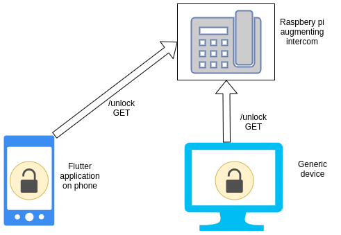
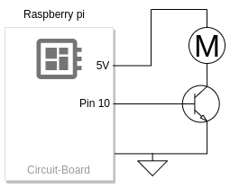

# Intercom Raspberry Pi Module

## Motivations

Older intercoms usually do not have any kind of digital interface. Typically the user has to physically interact with the device via it's analogue buttons.

[TODO: Insert example intercom picture]

Fortunately modern technology has allowed us to augment these dated interfaces that we must interact with throughout our daily lives. By combining a network-connected raspberry pi with a motor circuit, 3D printed case and some code we can wireless interact with our intercom.

## Architecture

The diagram below illustrates how all these pieces would fit together at a high level.

By exposing an `/unlock` REST endpoint on the Raspberry Pi (on the local network) we are able to trigger the motor attached to the Pi from a device connected to the same network. As a result of only exposing the endpoint on the local network, we are able to remove the necessity of requiring authentication. Future improvements could see an introduction of some level of security to prevent unauthorised access.

When the endpoint is hit and the motor is triggered it will rotate ultimately pressing the physical "unlock" button on the intercom. This gives us the ability to trigger this physical button remotely from our phone or other device (provided it is connected to the local network).

In the name of completeness we can see how the motor should connect to the Pi. The motor is driven by the 5V output from the Pi, triggered by a HIGH signal from pin 10 enabling the NPN transistor gate.

